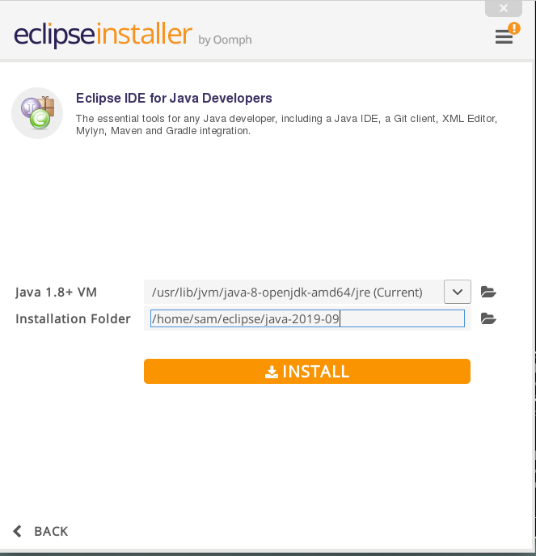

# StateDMI / Development Environment / Eclipse #

*   [Introduction](#introduction)
*    [Windows](#windows)
     +   [Download Eclipse](#download-eclipse)
     +   [Install Eclipse](#install-eclipse)
     +   [Check Eclipse Run Script](#check-eclipse-run-script)
*    [Linux](#linux)

-----

## Introduction ##

The Eclipse Integrated Development Environment (IDE) has traditionally been used for StateDMI software development and is recommended.
Alternate IDEs may be supported at some point; however, investigating impacts of using other IDEs
on StateDMI development will require resources.
Eclipse does have some issues and limitations, but other IDEs have different issues.

StateDMI development has typically occurred on Windows computers, although the software can be deployed to other operating systems.

As discussed in the [Java](java.md) section,
OpenJDK Java 8 is currently used for development as of StateDMI version 5.2.0.
Oracle Java was used prior to 5.2.0.

StateDMI has been developed with various versions of Eclipse, including Mars, Neon, 2019-03 and later versions.
The version of Eclipse is generally not critical as long as the appropriate Java version is configured for compatibility.

The Eclipse `.project` file is currently saved in the Git repository for each StateDMI component repository
in order to facilitate development environment setup.  This may change in the future.
Using a compatible version of Eclipse between developers ensures that the format of such files is consistent.

The Eclipse workspace (`.metadata`) folder is not saved in Git repository and is instead
is recommended to be saved in `eclipse-workspace` folder under the StateDMI product folder
in a standard development folder structure.

##  Windows ##

**This documentation was created for an older version of Eclipse and needs to be updated.
The process for current installations is similar.**

### Download Eclipse 2019-03 (or newer) ###

The download links for Eclipse may change as new versions are released.
Download the ***Eclipse IDE for Java Developers*** (there is currently no reason to use the Eclipse IDE for Java EE Developers,
which is used for web development).  Make sure to select the ***Windows 64-bit*** version.
The zip file installer is convenient because it is very clear where the software is installed.

### Install Eclipse ###

The Eclipse installer file will be named `eclipse-java-2019-03-R-win32-x86_64.zip` or similar.
Note that later versions of Eclipse provide an option to use an installation program
so these instructions need to be updated when later versions of Eclipse are used.

To avoid confusion with other versions of Eclipse that may be installed on the computer (as needed for other product development),
install by copying/unzipping into a folder named `C:\Program Files\Eclipse\eclipse-java-2019-03`
(older 32-bit Neon version used `C:\Program Files (x86)\eclipse-java-neon-3-win32`).
The resulting folder structure is as shown in the following figure.

**<p style="text-align: center;">

</p>**

**<p style="text-align: center;">
Eclipse Software Folders (<a href="../images/eclipse-install-folder.png">see full-size image</a>)
</p>**

### Check Eclipse Run Script ###

The `cdss-app-statedmi-main` repository `build-util` folder contains scripts to run the correct version of Eclipse,
assuming a standard installation folder.  For example, `build-util/run-eclipse-win64.cmd` can be run from a Windows command shell.
This ensures that the proper versions of Eclipse and Java are used.
If necessary, this script can be modified or other versions added over time (for example for new versions of Java and Eclipse).

##  Linux ##

StateDMI is typically developed on Windows.
The Linux environment is not the primary development or production environment,
but may be be of interest for some developers.

The StateDMI Linux development environment is consistent with the operating system and 64-bit is used by default.
The following documentation was prepared for Debian Stretch.

### Download Eclipse ###

The Eclipse Linux version is downloaded from the
[main Eclipse Download Page](https://www.eclipse.org/downloads/packages/release/neon/2/eclipse-ide-java-developers).
Unlike Windows, newer versions of Eclipse can be used,
at least Neon but later has also been used (for example 2019-09 release).
Save the download file, for example `~/Downloads/eclipse-inst-linux64.tar.gz`.

### Install Eclipse ###

The Eclipse installer from the previous step should be unzipped, for example:

```
$ cd ~/Downloads
$ tar -xzvf ~/media/vbshare/eclipse-inst-linux64.tar.gz
```

The top level folder is `eclipse-installer`.  The installer is run using:

```
$ cd eclipse-installer
$ ./eclipse-inst
```

The following images illustrate the installation process.

First pick ***Eclipse IDE for Java Developers***.
The following defaults are shown, based on Java 8 being installed and using the standard
installation folder.

**<p style="text-align: center;">

</p>**

**<p style="text-align: center;">
Install Eclipse (<a href="../images/linux-install-eclipse1.png">see full-size image</a>)
</p>**

Press ***Install*** to install Eclipse.  Accept the license.
License certificates should also be accepted as shown below.

**<p style="text-align: center;">

</p>**

**<p style="text-align: center;">
Install Eclipse - Accept Certificates (<a href="../images/linux-install-eclipse2.png">see full-size image</a>)
</p>**

After the software is installed, Eclipse can be launched from the installer.
However, a run script is typically configured as discussed in the following section.

### Check Eclipse Run Script ###

The `cdss-app-statedmi-main` repository `build-util` folder contains scripts to run the correct version of Eclipse,
assuming a standard installation folder.
For example, `build-util/run-eclipse.bash` can be run from a Linux terminal.
This ensures that the proper versions of Eclipse and Java are used.
If necessary, this script can be modified or other versions added over time (for example for new versions of Java and Eclipse).
