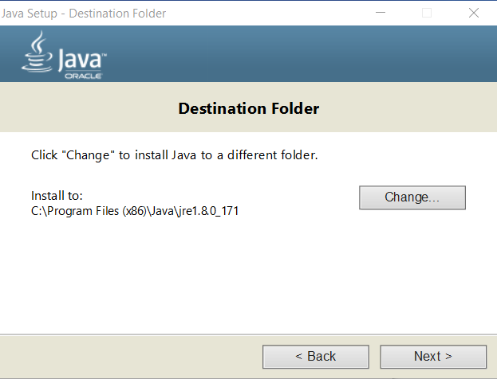

# StateDMI / Development Environment / Java 8 ##

* [Introduction](#introduction)
* [Download Java 8](#download-java-8)
* [Install Java 8](#install-java-8)
* [Create Symbolic Links for Java 8](#ceate-symbolic-links-for-java-8)
* [Confirm Run Script Configuration](#confirm-run-script-configuration)

------

## Introduction ##

Java 8 is currently used for StateDMI development, consistent with TSTool.
StateDMI does not currently use any native 32-bit third-party libraries (like TSTool); therefore,
there is not a restriction to update to 64-bit Java.
Java 64-bit version 9+ will be evaluated and will be phased in as soon as possible,
but requires confirmation that deployed systems including Linux variants support Java 9.

## Download Java 8 ##

StateDMI has traditionally been developed using Oracle Java.
The major version (8) is important and otherwise the latest minor version can be downloaded to ensure support
for recent operating systems and for security patches.

Download the Java SE Development Kit from the
[Oracle Java Download Site](http://www.oracle.com/technetwork/java/javase/downloads/jdk8-downloads-2133151.html).

The 32-bit version is named `Windows x86` or similar and the download file will be named `jdk-8u171-windows-i586.exe` or similar.

## Install Java 8 ##

Run the installer from the previous step.  Administrator privileges will be required.
The following procedure may vary slightly as new Java releases are made.


Press ***Next >*** to continue.


Accept the defaults in the above dialog without changing.
Note that since installing the 32-bit version the installation folder is `C:\Program Files (x86)`.
Other installations of Java may already exist on the computer, which is OK.
Press ***Next >*** to continue.



Accept the defaults in the above dialog without changing.
Press ***Next >*** to continue.  A progress indicator will be shown.


Press ***Close*** to close the above dialog.

## Create Symbolic Links for Java 8 ##

The Java installation process creates files as shown in the following image.


The use of version-specific folder can be problematic because Eclipse Java Runtime Environment and build utilities must
be configured to use the specific version.
This may result in developers with different minor versions of Java flip-flopping repository contents.
To minimize such issues, open a Windows command shell with Administrator privileges and create symbolic links as shown in the following image and
summarized below.
**Actualy, Exclipse seems to traverse the link and use the specific resource in its environment, showing the full path rather than the link,
but it is convenient nevertheless and is needed for the step below.**

```
mklink /d jdk8 jdk1.8.0_171
mklink /d jre8 jre1.8.0_171
```


In addition, the automated build system uses JRE folder that requires another symbolic link to find the JRE to distribute with the installer.
Create the link as follows in the `C:\Program Files (x86)\Java` folder:

```
mklink /d jre_18 jre8
```

## Confirm Run Script Configuration ##

The order that Java and Eclipse are installed may vary.
These major development environment components need to be configured appropriately and it is useful to use a run script to start Eclipse.

* [See information about the run script](eclipse.md#check-eclipse-run-scipt)
