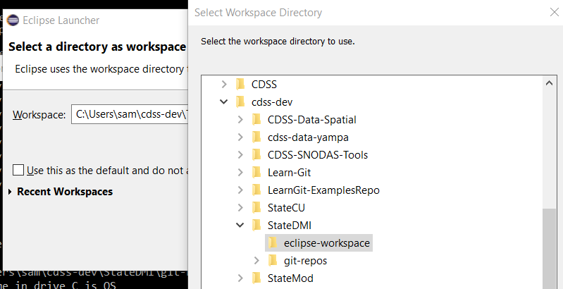
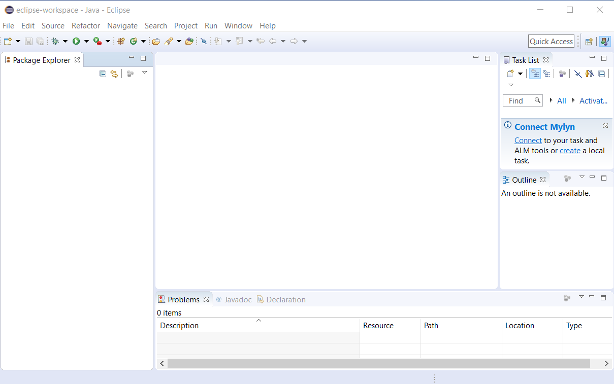
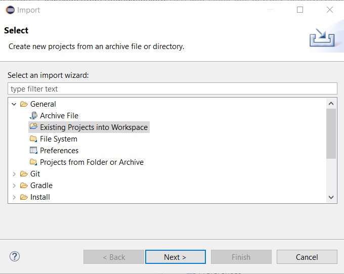
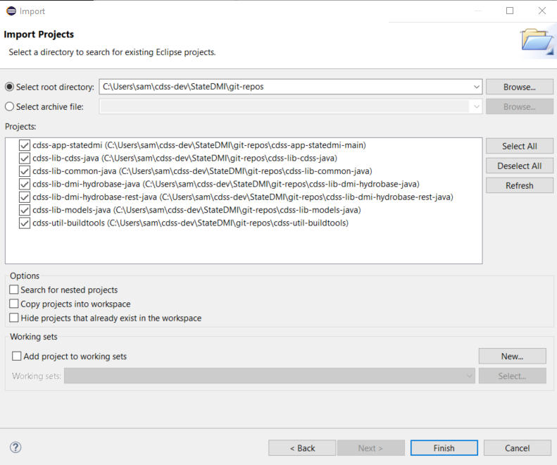
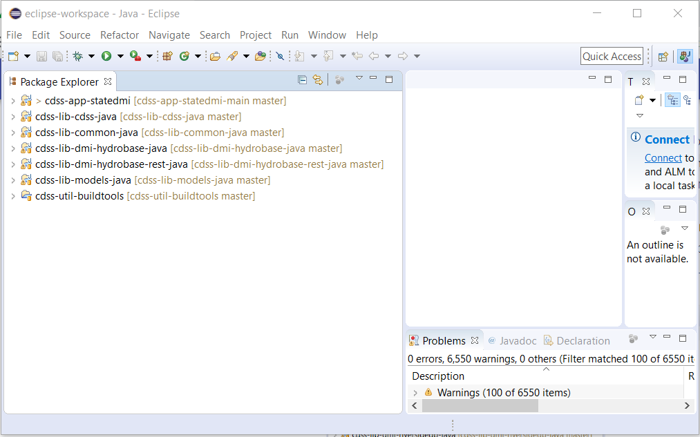

# StateDMI / New Developer Setup / Overview #

This documentation is for software developers that are members of the core StateDMI team and others who
have an interest in contributing to the StateDMI software project.
It is recommended that the StateDMI development environment should follow these setup instructions, which are
consistent with the [Development Environment](../dev-env/overview.md) and [Initial Project Setup](../project-init/overview.md) documentation.
The [standard development folder structure](../project-init/overview.md#development-files-structure)
should be followed to minimize potential for issues,
especially given the number of components and setup steps.
All of this documentation is consistent with the recommended development environment.

This documentation and development environment are also consistent with other CDSS Java software development environments,
in particular TSTool.

The intent of this documentation is to completely document setup steps and allow new developers to comment on this documentation
so that it can be improved for other developers. The following steps need to occur to set up a new developer's environment.
Links to other documentation are included to provide more information and "(**see details below**)" is used to indicate that
specific instructions are included below (rather than immediately linking to other pages from the following outline).
After reading instructions for a step, use "back" to return to this outline so that setup instructions can be followed in the proper sequence.
**Bold comments** indicate which steps are required and which are optional.

1. **Required:** [Machine for Development](../dev-env/machine.md) - need a suitable computer
2. **Required:** [Create folder for development files](#create-folder-for-development-files) - where development will occur (**see details below**)
3. **Required (if not already installed):** Development Environment software install part 1 (version control)
	* [Development Environment / Git](../dev-env/git.md) - install Git software so the repositories can be cloned
4. **Required:** [Clone Git Repositories](#clone-git-repositories) - clone the repositories to get access to all files (**see details below**)
5. **Required:** Development Environment software install part 2 (Java development tools)
	* **Required:** [Development Environment / Java 8](../dev-env/java8.md) - make sure Java 8 is available on system
	* **Required (if not already installed):** [Development Environment / Eclipse](../dev-env/eclipse.md) - install Eclipse for use as IDE
	* **Optional:** [Development Environment / KDiff3](../dev-env/kdiff3.md) - install software to facilitate comparing files
	**(highly useful and can be used with Git)**
	* **Optional:** [Development Environment / NSIS](../dev-env/nsis.md) - install software to create StateDMI software installer
	* **Optional:** [Development Environment / launch4j](../dev-env/launch4j.md) - install software to create StateDMI software installer
6. **Required:** Eclipse Workspace Setup (interactive development environment)
	* **Required:** [Create Eclipse Workspace Folder](#create-eclipse-workspace-folder) - simple manual step (***see details below***)
	* **Required:** [Import the Existing Eclipse StateDMI Projects from the Git Repository Folders](#import-the-existing-eclipse-statedmi-projects-from-the-git-repository-folders) -  import
	from Git repository working files (**see details below**)
7. **Optional:** Development Environment software install part 3 (documentation tools), **(install if will view and edit documentation within the development environment)**
	* [Development Environment / Python and pip](../dev-env/python.md) - install Python, which is needed by MkDocs
	* [Development Environment / MkDocs](../dev-env/mkdocs.md) - install MkDocs to view/edit full documentation locally.
	See [Development Tasks / Documenting](../dev-tasks/overview.md#documenting)
	for instructions on viewing documentation.
8. [Next Steps - Development Tasks](#next-steps-development-tasks) - be productive!

The following sections are referenced from the above outline.

-------------

## Create Folder for Development Files ##

Create a development home folder consistent with the [initial project setup](../project-init/overview.md) - this
is an umbrella folder for all StateDMI development files,
including software tools that are installed locally (as appropriate).
It is assumed that development will occur within a developer's home folder on the computer in order to provide separation from the
work of other developers on the computer.
Tools such as Git rely on a unique identity for developers in order to properly track edits to files
and working in a shared space can be problematic.
After the folder is created, additional instructions describe how to install development files into the folder.

###  Cygwin ###

[Cygwin](../resources.md#cygin) is a useful software platform to provide Linux programs on a Windows computer.
It may be convenient to use Cygwin for some work, such as running command-line utilities,
although the development environment has focused on Windows and Git Bash.

Do the following using a terminal window. Note that the syntax `~` indicates the home folder for Bash shell
and is equivalent to the `$HOME` environment variable location.
The following uses the Windows location for user files (rather than Cygwin location `/home/user`,
which are typically stored in the Windows Cygwin install folder `C:\cygwin64\home` folder),
which allows Eclipse and other tools to work in Windows on the files accessed via Cygwin.

```bash
$ cd /cygdrive/c/Users/user
$ mkdir cdss-dev
$ cd cdss-dev/
$ mkdir StateDMI
```

###  Linux ###

Do the following using a terminal window. Note that the syntax `~` indicates the home folder and is equivalent to the `$HOME` environment
variable location.

```bash
$ cd
$ mkdir cdss-dev
$ cd ~/cdss-dev/
$ mkdir StateDMI
```

###  Windows ###

Do the following in a Windows command shell, Git CMD, or perform the equivalent actions in file explorer, or Git Bash.

```com
> C:
> cd \Users\userName
> mkdir cdss-dev
> cd cdss-dev
> mkdir StateDMI
```

*Press* ***back*** *in the browser to return to the outline.*

## Clone Git Repositories ##

The GitHub repositories described in the [standard development folder structure](../project-init/overview.md#development-files-structure)
contain various components needed for StateDMI development.
Each repository will be cloned into a local folder.

If Eclipse is used for development (recommended),
the repositories will be imported into the Eclipse workspace as
Java projects (code) and general projects in a later step.

If prompted when using `git clone`, specify the GitHub account credentials.

###  Clone the repository files (Cygwin) ###

**It is recommened that a Windows development environment is used including Git Bash.
Cygwin can be used for repositories that are not included in Eclipse,
such as this developer documentation (`cdss-app-tstool-doc-dev`),
new MkDocs user documentation (`cdss-app-tstool-doc-user`),
and test repository (`cdss-app-tstool-test`).
However, experience has shown that mixing Git Bash and Cygwin results in
excessive Git messages about end of line, and file execute permission file mode is not handed the same.
Using Windows/Git Bash for all repositories avoids issues with the filemode executable property.**

It may be possible to fully develop StateDMI in a Cygwin environment,
but this is not a focus of this documentation.

Follow the instructions for Linux (see below) but change the first step to the following to ensure that
the shared Cygwin/Windows file location is used.

```bash
$ cd /cygdrive/c/Users/user/cdss-dev/StateDMI
```

###  Clone the repository files (Windows) ###

Use a Windows Git client.  Git Bash is recommended.
Perform the following steps. Output is shown to illustrate typical behavior for user "sam";
however, output may not be exact as software is updated over time.
Cloning all the repositories may take several minutes to complete

```
$ cd
$ cd cdss-dev/StateDMI
$ mkdir git-repos
$ cd git-repos/
$ git clone https://github.com/OpenCDSS/cdss-app-statedmi-main.git
...

$ cd cdss-app-statedmi-main/build-util
$ ./git-clone-all-statedmi.sh
operatingSystem=mingw (used to check for Cygwin and filemode compatibility)

Clone all repositories for the product to set up a new developer environment.
The following is from /c/Users/sam/cdss-dev/StateDMI/git-repos/cdss-app-statedmi-main/build-util/product-repo-list.txt

--------------------------------------------------------------------------------
# Repositories that comprise StateDMI
# - assumes that local folder name will match the repository name
cdss-app-statedmi-doc-dev
cdss-app-statedmi-doc-user
cdss-app-statedmi-main
cdss-app-statedmi-test
cdss-lib-cdss-java
cdss-lib-common-java
cdss-lib-dmi-hydrobase-java
cdss-lib-dmi-hydrobase-rest-java
cdss-lib-models-java
cdss-util-buildtools
--------------------------------------------------------------------------------

All repositories that don't already exist will be cloned to /c/Users/sam/cdss-dev/StateDMI/git-repos.
Repositories will be cloned using root URL https://github.com/OpenCDSS
You may be prompted to enter credentials.
Continue [y/n]?: y
================================================================================
Cloning repository:  cdss-app-statedmi-doc-dev
Repository folder:  /c/Users/sam/cdss-dev/StateDMI/git-repos/cdss-app-statedmi-doc-dev
Repository Url:  https://github.com/OpenCDSS/cdss-app-statedmi-doc-dev
Cloning into 'cdss-app-statedmi-doc-dev'...
remote: Enumerating objects: 86, done.
remote: Counting objects: 100% (86/86), done.
remote: Compressing objects: 100% (57/57), done.
remote: Total 255 (delta 7), reused 55 (delta 6), pack-reused 169
Receiving objects: 100% (255/255), 2.45 MiB | 4.46 MiB/s, done.
Resolving deltas: 100% (19/19), done.
================================================================================
Cloning repository:  cdss-app-statedmi-doc-user
Repository folder:  /c/Users/sam/cdss-dev/StateDMI/git-repos/cdss-app-statedmi-doc-user
Repository Url:  https://github.com/OpenCDSS/cdss-app-statedmi-doc-user
Cloning into 'cdss-app-statedmi-doc-user'...
remote: Enumerating objects: 622, done.
remote: Counting objects: 100% (622/622), done.
remote: Compressing objects: 100% (617/617), done.
remote: Total 1564 (delta 3), reused 617 (delta 3), pack-reused 942
Receiving objects: 100% (1564/1564), 9.33 MiB | 5.99 MiB/s, done.
Resolving deltas: 100% (388/388), done.
Checking out files: 100% (792/792), done.
================================================================================
Cloning repository:  cdss-app-statedmi-main
Repository folder:  /c/Users/sam/cdss-dev/StateDMI/git-repos/cdss-app-statedmi-main
Repository Url:  https://github.com/OpenCDSS/cdss-app-statedmi-main
Repo folder already exists so skipping:  /c/Users/sam/cdss-dev/StateDMI/git-repos/cdss-app-statedmi-main
================================================================================
Cloning repository:  cdss-app-statedmi-test
Repository folder:  /c/Users/sam/cdss-dev/StateDMI/git-repos/cdss-app-statedmi-test
Repository Url:  https://github.com/OpenCDSS/cdss-app-statedmi-test
Cloning into 'cdss-app-statedmi-test'...
remote: Enumerating objects: 11, done.
remote: Total 11 (delta 0), reused 0 (delta 0), pack-reused 11
Unpacking objects: 100% (11/11), done.
================================================================================
Cloning repository:  cdss-lib-cdss-java
Repository folder:  /c/Users/sam/cdss-dev/StateDMI/git-repos/cdss-lib-cdss-java
Repository Url:  https://github.com/OpenCDSS/cdss-lib-cdss-java
Cloning into 'cdss-lib-cdss-java'...
remote: Enumerating objects: 20, done.
remote: Counting objects: 100% (20/20), done.
remote: Compressing objects: 100% (12/12), done.
remote: Total 391 (delta 4), reused 15 (delta 3), pack-reused 371
Receiving objects: 100% (391/391), 857.13 KiB | 3.03 MiB/s, done.
Resolving deltas: 100% (132/132), done.
================================================================================
Cloning repository:  cdss-lib-common-java
Repository folder:  /c/Users/sam/cdss-dev/StateDMI/git-repos/cdss-lib-common-java
Repository Url:  https://github.com/OpenCDSS/cdss-lib-common-java
Cloning into 'cdss-lib-common-java'...
remote: Enumerating objects: 11022, done.
remote: Total 11022 (delta 0), reused 0 (delta 0), pack-reused 11022
Receiving objects: 100% (11022/11022), 14.36 MiB | 6.23 MiB/s, done.
Resolving deltas: 100% (7696/7696), done.
Checking out files: 100% (788/788), done.
================================================================================
Cloning repository:  cdss-lib-dmi-hydrobase-java
Repository folder:  /c/Users/sam/cdss-dev/StateDMI/git-repos/cdss-lib-dmi-hydrobase-java
Repository Url:  https://github.com/OpenCDSS/cdss-lib-dmi-hydrobase-java
Cloning into 'cdss-lib-dmi-hydrobase-java'...
remote: Enumerating objects: 2675, done.
remote: Total 2675 (delta 0), reused 0 (delta 0), pack-reused 2675
Receiving objects: 100% (2675/2675), 10.91 MiB | 6.71 MiB/s, done.
Resolving deltas: 100% (1739/1739), done.
Checking out files: 100% (457/457), done.
================================================================================
Cloning repository:  cdss-lib-dmi-hydrobase-rest-java
Repository folder:  /c/Users/sam/cdss-dev/StateDMI/git-repos/cdss-lib-dmi-hydrobase-rest-java
Repository Url:  https://github.com/OpenCDSS/cdss-lib-dmi-hydrobase-rest-java
Cloning into 'cdss-lib-dmi-hydrobase-rest-java'...
remote: Enumerating objects: 1629, done.
remote: Total 1629 (delta 0), reused 0 (delta 0), pack-reused 1629
Receiving objects: 100% (1629/1629), 1.95 MiB | 3.25 MiB/s, done.
Resolving deltas: 100% (862/862), done.
================================================================================
Cloning repository:  cdss-lib-models-java
Repository folder:  /c/Users/sam/cdss-dev/StateDMI/git-repos/cdss-lib-models-java
Repository Url:  https://github.com/OpenCDSS/cdss-lib-models-java
Cloning into 'cdss-lib-models-java'...
remote: Enumerating objects: 2845, done.
remote: Total 2845 (delta 0), reused 0 (delta 0), pack-reused 2845
Receiving objects: 100% (2845/2845), 8.90 MiB | 6.19 MiB/s, done.
Resolving deltas: 100% (2076/2076), done.
Checking out files: 100% (339/339), done.
================================================================================
Cloning repository:  cdss-util-buildtools
Repository folder:  /c/Users/sam/cdss-dev/StateDMI/git-repos/cdss-util-buildtools
Repository Url:  https://github.com/OpenCDSS/cdss-util-buildtools
Cloning into 'cdss-util-buildtools'...
remote: Enumerating objects: 1454, done.
remote: Total 1454 (delta 0), reused 0 (delta 0), pack-reused 1454
Receiving objects: 100% (1454/1454), 13.63 MiB | 7.24 MiB/s, done.
Resolving deltas: 100% (601/601), done.
Checking out files: 100% (525/525), done.
================================================================================

After cloning, /c/Users/sam/cdss-dev/StateDMI/git-repos contains:
cdss-app-statedmi-doc-dev
cdss-app-statedmi-doc-user
cdss-app-statedmi-main
cdss-app-statedmi-test
cdss-lib-cdss-java
cdss-lib-common-java
cdss-lib-dmi-hydrobase-java
cdss-lib-dmi-hydrobase-rest-java
cdss-lib-models-java
cdss-util-buildtools
```

If a Windows command prompt window is used,
then the `git-clone-all-statedmi.sh` script cannot be run and all repositories must be manually cloned.
In this case, do the following **instead of the above**:

```com
> C:
> cd \Users\user\cdss-dev\StateDMI
> mkdir git-repos
> cd git-repos
> git clone https://github.com/OpenCDSS/cdss-app-statedmi-doc-dev.git
> git clone https://github.com/OpenCDSS/cdss-app-statedmi-doc-user.git
> git clone https://github.com/OpenCDSS/cdss-app-statedmi-main.git
> git clone https://github.com/OpenCDSS/cdss-app-statedmi-test.git
> git clone https://github.com/OpenCDSS/cdss-lib-cdss-java.git
> git clone https://github.com/OpenCDSS/cdss-lib-common-java.git
> git clone https://github.com/OpenCDSS/cdss-lib-dmi-hydrobase-java.git
> git clone https://github.com/OpenCDSS/cdss-lib-dmi-hydrobase-rest-java.git
> git clone https://github.com/OpenCDSS/cdss-lib-models-java.git
> git clone https://github.com/OpenCDSS/cdss-util-buildtools.git
```

The resulting files should match the [Development Files Structure](../project-init/overview.md#development-files-structure).

*Press* ***back*** *in the browser to return to the outline.*

## Create Eclipse Workspace Folder ##

This step creates the `eclipse-workspace` workspace folder where Eclipse saves its files to manage the StateDMI software, 
as discussed in the [Development Files Structure](../project-init/overview.md#development-files-structure).

The recommended Eclipse workspace folder for different environments is as follows:

*  Linux:  the workspace folder is `/cygdrive/c/Users/user/cdss-dev/StateDMI/eclipse-workspace`
*  Linux:  the workspace folder is `~/cdss-dev/StateDMI/eclipse-workspace`
*  Windows: the workspace folder is `C:\Users\user\cdss-dev\StateDMI\eclipse-workspace`

The folder can be created on the command line or with the file system tool.  Or, create in Eclipse as shown below.

###  Windows ###

Start Eclipse by running the Eclipse run script in a Windows command prompt window as shown below.
This script can be run any time Eclipse needs to be run.
It may also be possible to run the batch file from Git Bash but this has not been fully verified.

```bash
> C:
> cd \Users\user\cdss-dev\StateDMI\git-repos\cdss-app-statedmi-main\build-util
> run-eclipse-win32.bat
```

Open the workspace in Eclipse in preparation of adding the code project from the Git repository in the next step.
If the `eclipse-workspace` folder does not exist, it can be created using the Eclipse dialog.
Select the workspace as shown in the following figure.



The Eclipse workspace folder is identified by a `.metadata` folder, which will be hidden on Linux.

*Press* ***back*** *in the browser to return to the outline.*

## Import the Existing Eclipse StateDMI Projects from the Git Repository Folders ##

The StateDMI repositories each correspond to discrete components that must be imported into the StateDMI Eclipse workspace.
The development environment does not currently use Maven,
which is a tool that helps with library dependencies and build processes.
Instead, required third-party libraries are committed to the repository as jar files and are updated periodically.
Upgrading to Maven would be a major change in the development environment and may be implemented in the future.
Currently, eclipse `.project` files are committed to each repository,
which allows the repository folders to be imported and be recognized as projects by Eclipse.
This approach may be changed as resources are allocated to evolving the development environment.

The repositories fall into four categories, which are discussed in the following sections.
All of the repositories obviously use Git for version control (Eclipse generally detects this automatically when a project is imported).

1. Code repositories with names ending with `java` are treated as Java projects.
2. The CDSS build utility repository `cdss-util-buildtools` is treated as a general project as is currently required to create the software installer.
3. The StateDMI function test repository `cdss-app-statedmi-test` is treated as a general project and is useful to import into Eclipse.
4. Documentation repositories with `doc` in names can be treated as general projects
and do not need to be imported because their files are typically edited outside of Eclipse.

### Import Code Repositories ###

After Eclipse is started and the initial Eclipse workspace is selected,
import the following repositories by following the same general procedure indicated below:

* `cdss-app-statedmi-main`
* `cdss-lib-cdss-java`
* `cdss-lib-common-java`
* `cdss-lib-dmi-hydrobase-java`
* `cdss-lib-dmi-hydrobase-rest-java`
* `cdss-lib-models-java`

The initial workspace will be similar to the following (if necessary, close the ***Welcome*** tab).
Use the ***Help / About Eclipse*** menu to check the Eclipse version,
which should be consistent with the ***Development Environment / Eclipse*** instructions.



Because the `.project` files have already been created and are included in the repository,
a general import of existing project can occur and Eclipse will figure out other
information such as whether a Java project.
Use the ***File / Import...*** menu to start an import, as shown in the following figure.
Click on ***General*** to expand the choices and then on ***Existing Projects into Workspace***.



Press ***Next >*** in the above dialog to continue to the following step.
Use the ***Browse...*** button to browse to the `git-repos` folder where repositories where cloned.



All the existing projects can be added at once as shown in the following image.
Note that ***Copy projects into workspace*** is NOT checked and defaults
can be used without changing. This allows the files to exist in the Git repository folders.
Note that some repositories that were cloned, such as newer Markdown/MkDocs documentation,
are not listed because these repositories are typically maintained without using Eclipse.

Press ***Finish*** to start the import. Eclipse will automatically try to compile TSTool
and should properly handle project dependencies because the `.classpath` file
is also saved in each repository/project. Eclipse may require several minutes to recompile the software.
The default settings may not result in a full build; however,
in the following image there were no fatal errors that prevented a build.
The right arrow (***>***) symbol next to a component indicates that there are changes,
in this case because the files were being modified to create this documentation.



*Press* ***back*** *in the browser to return to the outline.*

## Next Steps - Development Tasks ##

At this point it should be possible to [compile](../dev-tasks/overview.md#compiling) and
[run](../dev-tasks/overview#running) StateDMI within the Eclipse interface].  See also:

* [Deployed Environment / Overview](../deployed-env/overview.md) - for an overview of the deployed software
* [Software Design / Overview](../software-design/overview.md) - to understand software structure and logic
* [Development Tasks / Overview](../dev-tasks/overview.md) - common development tasks
