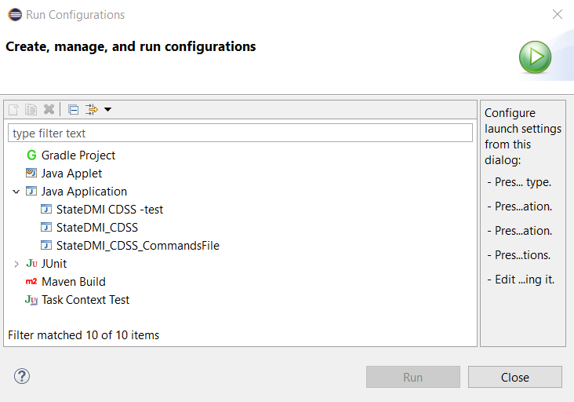

# StateDMI / Development Tasks / Running #

* [Running StateDMI from Eclipse](#running-statedmi-from-eclipse)
* [Development Run Environment](#development-run-environment)

----------------

## Running StateDMI from Eclipse ##

StateDMI can be run within the development environment using run configurations.
The following figure shows how to access the configurations.
Old run configurations will likely be removed and new ones added as StateDMI continues to evolve.

Run configurations are as follows, and the ***StateDMI_CDSS*** run configuration can be used to start an interactive StateDMI session:

## Development Run Environment ##

The run environment when working with Eclipse is not the same as the installed software environment.
The following configuration is used to effectively run StateDMI during develop and mimic the installed environment:

1. The `test/operational` folder in the `cdss-app-statedmi-main` repository contains files needed to run StateDMI as if operational.
2. Command-line parameters are used to tell StateDMI where the above test folder is (rather than default installed location).
For example, see the `StateDMI_CDSS` run configuration shown in the previous section.  In particular:
	1. The run configuration ***Arguments*** settings uses `-home test/operational/CDSS` to tell
	StateDMI to use the specified folder for its installation home in the development environment.
	The folder is relative to the Eclipse project location,
	which corresponds to the Git repository working files.
	2. The ***VM arguments*** are similar to those specified in the Launch4J deployed run-time configuration.
3. StateDMI is being updated to now use a `.statedmi` folder in the user's files to store user-specific information.
These files are now also used by developers.
For example, testing with the State of Colorado's HydroBase database requires using default input type or HydroBase datastore.
Users can control data access by enabling and disabling datastores as needed.
Different repositories and documentation provide example datastore configurations that can be used by software developers.
**This design is being phased in.**
4. Documentation is being migrated to online.
Therefore, testing any links to documentation will typically point to deployed documentation URLs.
**This design is being phased in.**
