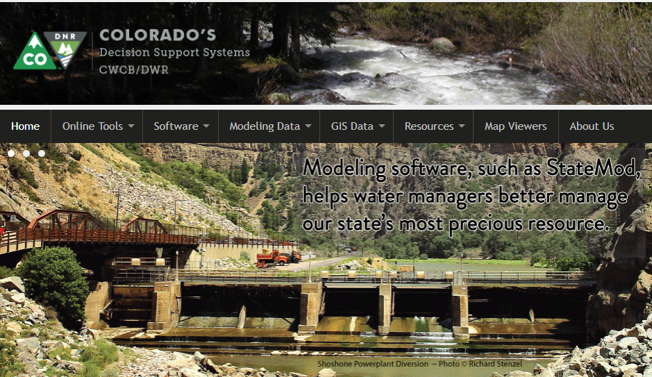

# CDSS / StateDMI (Developer) #

This developer documentation explains how to build, enhance, and maintain
[Colorado's Decision Support Systems (CDSS)](http://cdss.state.co.us/Pages/CDSSHome.aspx) StateDMI software.
StateDMI software automates processing data files for StateCU and StateMod models,
in particular files that are not handled by TSTool (which focuses on time series).
See also the [StateDMI User Documentation](http://learn.openwaterfoundation.org/cdss-app-statedmi-doc-user/)
(**Markdown/MkDocs documentation is not yet available - current documentation is Word/PDF**).

* [How to Use this Documentation](#how-to-use-this-documentation)
* [Acknowledgements](#acknowledgements)
* [Colorado's Decision Support Systems](#colorados-decision-support-systems)
* [About the Open Water Foundation](#about-the-open-water-foundation)
* [License](#license)
* [Source Repository on GitHub](#source-repository-on-github)
* [Release Notes](#release-notes)

----------------

## How to Use this Documentation ##

This website is a companion to the StateDMI source code and provides guidance for software developers that modify and
support StateDMI.  StateDMI is similar to TSTool software;
however, TSTool is more generic and is often used outside of CDSS modeling.
StateDMI is primarily focused on CDSS modeling.
Use StateDMI for specific time series processing (such as crop parcels) and use TSTool as needed for other time series.

The documentation is organized with the first sections focusing on setup for a new developer and common development tasks.
The reference sections at the end provide information that may be of use but are typically not used day to day.
Use the search feature of this website to find specific information.

The StateDMI development environment currently focuses on creating 32-bit Java StateDMI runtime for use on Windows computers.
Use on Linux is possible but has not been a part of development i the past.
Migration to 64-bit version will occur as components are updated.
Icons for Cygwin , Linux , and Windows 
are included to help indicate documentation
specific to an operating system.

* [New Developer Setup](dev-new/overview/) - **new StateDMI software developers should start here**
* [Development Tasks](dev-tasks/overview/) - describes common development tasks - **refer to this after new development environment is configured**
* [REFERENCE: Software Design](software-design/overview/) - provides details about the software code design
* [REFERENCE: Deployed Environment](deployed-env/overview/) - describes the deployed environment after software is installed
* [REFERENCE: Development Environment](dev-env/overview/) - describes development environment software installation
* [REFERENCE: Initial Project Setup](project-init/overview/) - describes initial project setup and file structure

Use the navigation menu provided on the left side of the page to navigate the documentation sections within the full document.
Use the navigation menu provided on the right side of the page to navigate the documentation sections with a page.
The navigation menus may not be displayed if the web browser window is narrow or if viewing on a mobile device,
in which case look for a menu icon to access the menus.
Use the search feature to find documentation matching the search words.

## Acknowledgements

StateDMI has been developed by the Open Water Foundation (OWF) with significant
funding provided by the Colorado Water Conservation Board (CWCB)
in coordination with the Division of Water Resources (DWR),
as part of Colorado’s Decision Support Systems (CDSS).

StateDMI software developers are encouraged to provide feedback using the
[GitHub Issues page](https://github.com/OpenCDSS/cdss-app-statedmi-main/issues)
for the StateDMI main application repository,
or the issues for the appropriate repositories.

Feedback specific to CDSS functionality (e.g.,
HydroBase, StateMod, StateModB, StateCU input)
can also be provided using the [CDSS email address](mailto:DNR_OpenCDSS@state.co.us).

### Software Components

The following components are used in StateDMI and require or request attribution:

* [Material Theme icons](https://material.io/icons/) - these icons are used in documentation

## Colorado's Decision Support Systems ##

[Colorado's Decision Support Systems (CDSS)](https://www.colorado.gov/cdss)
has been developed to answer important questions about Colorado's water resources.
CDSS efforts are led by the [Colorado Water Conservation Board (CWCB)](http://cwcb.state.co.us)
and [Colorado Division of Water Resources (DWR)](http://water.state.co.us).

CDSS has been under development since 1994, with progress occurring via a series of basin
decision support systems (DSS), starting with the Colorado River DSS (CRDSS).
Other focused DSS were also developed, such as the CWCB's Instream Flow DSS.
Each DSS resulted in enhancements to the core CDSS tools,
which are envisioned as a general platform of data and tools to help with water supply planning.

The StateDMI software was developed in CDSS to process data
from Colorado's HydroBase database into into water resources model data files.
Since the initial development, StateDMI has been enhanced to use additional data sources,
add commands with new functionality, and add new functionality to facilitate interactive
and automated data processing.

In late 2016, the Open Water Foundation began the effort to move StateDMI and other CDSS software to open source licensing
and establish open source software projects, referred to as "OpenCDSS".
The OpenCDSS project is resulting in a significant evolution in how CDSS software development occurs,
such as implementing version control with Git/GitHub and modernizing the development environment and documentation.
See the [OpenCDSS Website](http://learn.openwaterfoundation.org/cdss-website-opencdss/) for more information.

## About the Open Water Foundation ##

The [Open Water Foundation](http://openwaterfoundation.org) is a nonprofit social enterprise that focuses
on developing and supporting open source software for water resources,
so that organizations can make better decisions about water.
OWF also works to advance open data tools and implementation.
OWF staff have been the primary StateDMI developers on State of Colorado and other projects.

## License ##

This StateDMI documentation is licensed using the
[Creative Commons Attribution International 4.0 (CC BY 4.0) license](https://creativecommons.org/licenses/by/4.0/).

The StateDMI software is licensed using the GPL 3 license (see the
[StateDMI software repository](https://github.com/OpenCDSS/cdss-app-statedmi-main).

## Source Repository on GitHub ##

The source files for this documentation are maintained in a GitHub repository:
[cdss-app-statedmi-doc-dev](https://github.com/OpenCDSS/cdss-app-statedmi-doc-dev).

This developer documentation is currently maintained in a repository that is separate from StateDMI code
in order to avoid confusion with the legacy documentation and to facilitate updates.

## Release Notes ##

See the [StateDMI release notes](http://learn.openwaterfoundation.org/cdss-app-statedmi-doc-user/appendix-release-notes/release-notes)
section of the StateDMI user documentation for information about StateDMI software changes.
